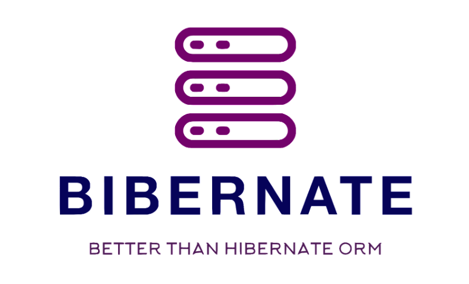

# Description
Bibernate is open source ORM for RDBMS databases with strong code quality and excellent test coverage,
which has a lot of features for persisting entities.
It provides simple and understandable annotation mapping, 
configuration, cache first level, persistence context, entity manegmanet,
concurrency control etc. The list of all features with code examples you can read using our documentation.

# Technologies 

| Requirements                   	 | Reason                         	     |
|----------------------------------|--------------------------------------|
| Java 17 LTS           	       | Application                        	 |    |
| Maven version 3.6.3+ 	           | Builder 	                          |

## Technology stack
| Technology name                   	 | Version                        	 |
|-------------------------------------|----------------------------------|
| JDK        	                         | 17 LTS                           |
| HikariCP        	                     | 5.0.1                          |
| lombok        	                     | 1.18.24                          |
| log4j-core        	                 | 2.7                         |

